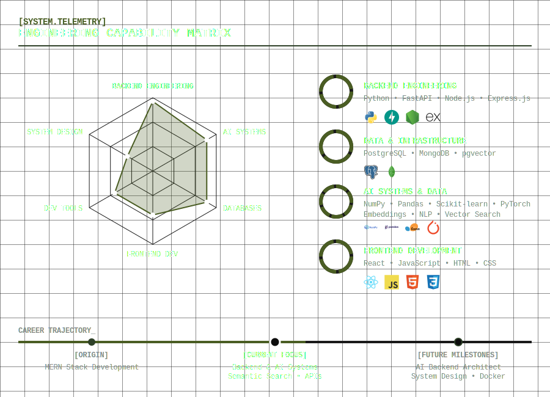

  <h1>Hi, I'm Bharadwaj </h1>
  <h3>Full-Stack Foundations • AI Backend Focus</h3>
  
  

    <b>Connect with me:</b>  
    
    
    
    
  

---

##  About Me

-  B.Tech CSE Student at Vignan's Institute of Information Technology, Visakhapatnam
-  Experience : AI-Backend Engineer Intern @ Indian Navy and Full-Stack Developer Intern @ Velocitix AI
-  Currently building AI-powered backend systems, semantic search pipelines, and intelligent applications
-  Learning Backend Engineering, System Design, Cloud Fundamentals, and AI Infrastructure
-  Looking to collaborate on Backend, AI, Open Source, and Full-Stack projects
-  Ask me about FastAPI, PostgreSQL, MERN Stack, AI Applications, Vector Search, and DSA
-  Leetcode Max Rating: 1615 | CodeChef Rating: 1367 (Peak Rating:1405)
-  Solved 500+ DSA problems across coding platforms
-  **Outside Tech:** Formula 1 enthusiast and Hot Wheels collector.

---

##  Tech Stack

  

---

##  GitHub Statistics

  
  

  

---

  <i>"Build systems, not demos."</i>  
  <b><a href="mailto:bharadwajflasmup@gmail.com">Let's build something together!</a></b>

